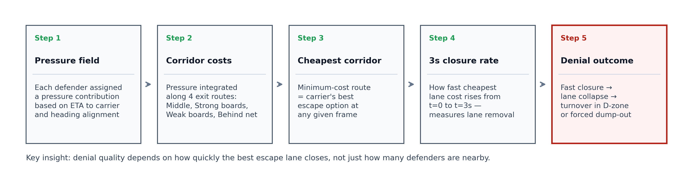
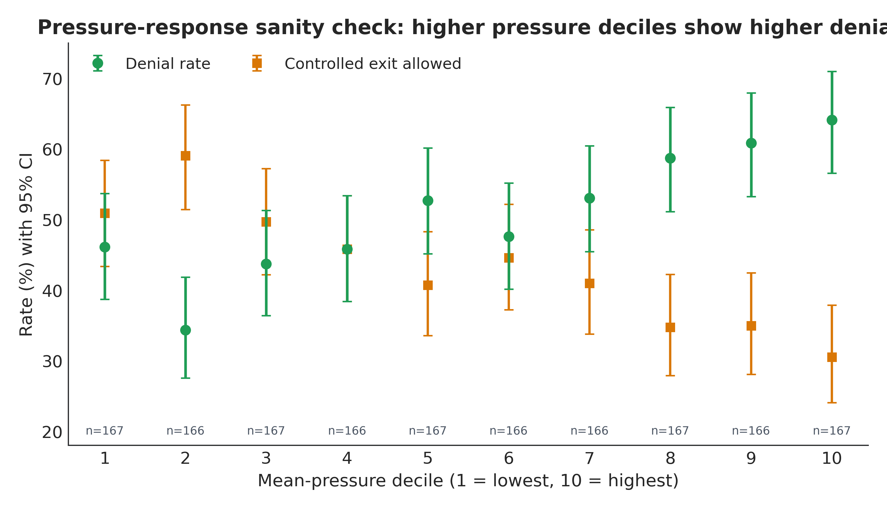

# Big Data Cup 2026

## Forechecking Pressure Topology

This repository contains our Big Data Cup 2026 submission, **Forechecking Pressure Topology**, a carrier-centric framework for measuring how layered forechecking pressure removes exit lanes during defensive-zone retrievals.

**Quick links**

- [Final report PDF](projects/forechecking_pressure_topology/report_v1/forechecking_pressure_topology_final_draft.pdf)
- [Project overview](projects/forechecking_pressure_topology/README.md)
- [LaTeX source](projects/forechecking_pressure_topology/report_v1/main.tex)
- [Report assets and rebuild instructions](projects/forechecking_pressure_topology/report_v1/README.md)

## Research Question

How does forechecking pressure influence defensive-zone retrieval failure, and can a spatial pressure-topology model predict turnovers more accurately than traditional proximity-based approaches?

## Why This Project Exists

Forechecking is often described with system labels like `1-2-2` or `2-1-2`, but the retrieval denial is driven by continuous spatial pressure: who arrives first, who closes the second option, and how quickly the carrier's best escape lane disappears.

Our framework, **Retrieval Denial Topology (RDT)**, turns that sequence into measurable signals:

- pressure intensity at the puck carrier
- exit-lane availability
- 3-second lane closure
- layered support from the first, second, and third forecheckers
- D-pinch support and score-state context

## Headline Results

| Metric | Result |
| --- | --- |
| Dataset | 10 public Big Data Cup 2026 games |
| Retrieval episodes | 2,086 |
| Tracking frames evaluated | 14,921 |
| Pressure-response trend | Denial rises from 46.1% in the lowest pressure decile to 64.1% in the highest |
| Best turnover model | `AUC = 0.742` |
| Best simple baseline | `AUC = 0.640` using nearest-defender distance |
| Main hockey takeaway | Strong forechecks are layered forechecks; F2 and F3 support materially improves denial |

`AUC` refers to area under the ROC curve. In this setting, higher is better.

## Visual Overview



The pipeline starts from tracking and event data, builds frame-level pressure and corridor signals, aggregates them into episode-level features, and then uses those signatures for coaching interpretation and turnover prediction.



Higher-pressure retrievals are consistently harder to escape cleanly.

## Repository Guide

```text
projects/
  forechecking_pressure_topology/
    README.md                         project-level documentation
    run_pipeline.py                   end-to-end feature + modeling pipeline
    config/default_config.json        pipeline settings
    outputs/                          generated episode, frame, clustering, and modeling outputs
    report_v1/
      forechecking_pressure_topology_final_draft.pdf
      main.tex                        final manuscript source
      figures/                        report figures
      build_pdf.ps1                   report build script
```

## Reproducing The Submission

Run the analysis pipeline from the repository root:

```bash
python projects/forechecking_pressure_topology/run_pipeline.py
```

Fast smoke test:

```bash
python projects/forechecking_pressure_topology/run_pipeline.py --max-games 2 --frame-stride 30
```

Rebuild the manuscript figures and PDF:

```bash
python projects/forechecking_pressure_topology/report_v1/scripts/make_figures.py
powershell -ExecutionPolicy Bypass -File projects/forechecking_pressure_topology/report_v1/build_pdf.ps1
```

## What Judges Should Open

If you only open one file, start here:

- [Final report PDF](projects/forechecking_pressure_topology/report_v1/forechecking_pressure_topology_final_draft.pdf)

If you want the implementation and generated outputs:

- [Project folder](projects/forechecking_pressure_topology/)

## Team

- Ryan Dajani
- Luke Blommesteyn
- Eric Schilha
- Yashna Garg
